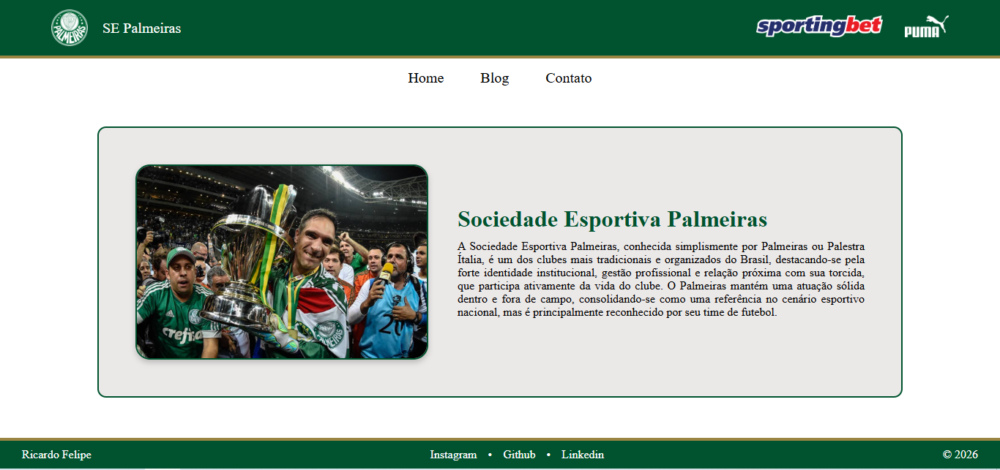

# Meu Primeiro Website

Este projeto consiste em um portal informativo dedicado ao Palmeiras, dentro do site o usuário conhecerá a história e o presente do clube. Através de uma interface organizada com uma navbar, o usuário pode explorar a página inicial com uma apresentação sobre o clube, mergulhar em uma página de blog que apresenta os ídolos, títulos e história, além de acessar uma seção de contato. Vale ressaltar que o projeto é focado exclusivamente no front-end, ou seja, o formulário de contato é apenas ilustrativo para demonstração de interface.

<p align="left">
  
</p>

## Sobre o Projeto

O objetivo deste site é melhorar minhas habilidades em HTML5 e CSS3. Ele foi desenvolvido utilizando o Palmeiras como tema para aplicar conceitos avançados de estruturação e design.

## Tecnologias

- HTML5 - Estrutura de conteúdo.
- CSS3 - Design.

## Link de Acesso

Visite o site aqui:

https://ricardo2357.github.io/Meu-Primeiro-Website/

## Estrutura do Projeto

```
├── images/
│   ├── Escudo-Palmeiras.png
│   ├── História-Palmeiras.jpg
│   ├── Logo-Puma.png
│   ├── Logo-Sportingbet.png
│   ├── Palmeiras-Comemoração.jpg
│   ├── Símbolo-Palmeiras.png
│   ├── Taça-Libertadores-Palmeiras.png
│   ├── preview-meu-primeiro-website.png
│   └── Ídolos-Palmeiras.jpg
├── LICENSE
├── README.md
├── blog.html
├── contact.html
├── index.html
└──  style.css
```

## Licença 

Este projeto está licenciado sob a MIT License - veja o arquivo [LICENSE](LICENSE) para mais detalhes. 
